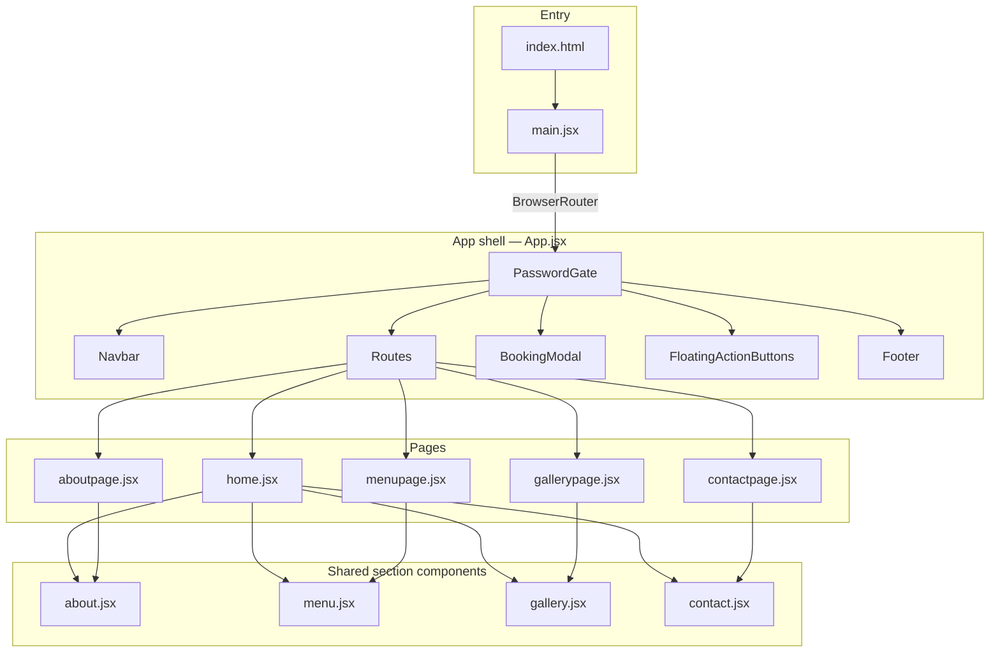

# ARANYAM — Jungle Theme Restaurant

Client concept site for **Aranyam Jungle Theme Restaurant** (Amogham Foods) — a premium, jungle-themed showcase across Warangal, Karimnagar, and Hyderabad.

| | |
|---|---|
| **Type** | Static SPA (marketing + booking UX) |
| **Language** | JavaScript (JSX) — no TypeScript in `src/` |
| **Author** | Pranith Konda |

---

## Tech stack

| Layer | Technology | Version (approx.) | Role |
|-------|------------|-------------------|------|
| UI library | [React](https://react.dev/) | 18.3 | Components, hooks, client-side UI |
| Bundler / dev server | [Vite](https://vitejs.dev/) | 5.4 | Fast HMR, ESM build, `@vitejs/plugin-react` |
| Routing | [React Router](https://reactrouter.com/) | 7.x | `BrowserRouter`, `Routes`, `Route`, `Link` |
| Styling | [Tailwind CSS](https://tailwindcss.com/) | **3.4** | Utility-first CSS via `tailwind.config.js` |
| CSS pipeline | PostCSS + Autoprefixer | 8.x / 10.x | Processes Tailwind in `postcss.config.js` |
| Icons | [Lucide React](https://lucide.dev/) | 0.34x | SVG icons (nav, contact, gallery controls) |
| Linting | ESLint 9 (flat config) | 9.x | `eslint.config.js` + React Hooks / Refresh plugins |

**Not used in source (listed in `package.json` only):** `@supabase/supabase-js` — no backend integration yet; forms are client-side UI.

**Intentionally not used:** Framer Motion, Redux/Zustand — animations and state are plain React + CSS/Tailwind.

### Why this stack

- **Vite + React** — lightweight SPA, easy static deploy (`dist/`), no SSR needed for a pitch site.
- **Tailwind v3** — custom `jungle`, `gold`, and `earth` palettes live in `tailwind.config.js` (v4’s config model differs; project standardizes on v3).
- **React Router** — share one layout (navbar, footer, booking modal) across `/`, `/about`, `/menu`, etc., while Home still stacks all sections for scroll-through demos.

### Typography & theme

Loaded in `src/index.css` from Google Fonts:

- **Cinzel** — headings, navigation, buttons  
- **Cormorant Garamond** — body, taglines  
- **Inter** — utility fallback  

Base background: `jungle-950` (`#041504`). Accents: `gold-400` / `gold-500`.

---

## Architecture



### Boot sequence

1. `index.html` mounts `#root` and loads `/src/main.jsx` as an ES module.  
2. `main.jsx` wraps the app in `StrictMode` and `BrowserRouter`.  
3. `App.jsx` renders global shell: password gate → navbar → routed page → booking modal → FABs → footer.  
4. **Hero** lives in `App.jsx` (`HeroSection`) and is passed into `Home` as a prop (parallax hero is not a separate route).

### Routing

| Path | Page file | Content |
|------|-----------|---------|
| `/` | `pages/home.jsx` | Hero + About + Menu + Gallery + Contact (single-scroll landing) |
| `/about` | `pages/aboutpage.jsx` | `about.jsx` only |
| `/menu` | `pages/menupage.jsx` | `menu.jsx` + book CTA |
| `/gallery` | `pages/gallerypage.jsx` | `gallery.jsx` |
| `/contact` | `pages/contactpage.jsx` | `contact.jsx` |

Navbar (`navbar.jsx`) uses `Link` + `useLocation()` for active route styling.

### State & data

| Concern | Implementation |
|---------|----------------|
| Auth / demo lock | `PasswordGate` in `App.jsx` — local `useState`; password constant in component |
| Booking UI | `bookingOpen` in `App.jsx`; `onBookTable` passed to Navbar, Hero, Menu |
| Menu filters | `menu.jsx` — `useState` for category, veg filter, search; `DISHES` / `CATEGORIES` static arrays |
| Gallery | Lightbox index, video play/mute — component-local state |
| Scroll effects | `useEffect` listeners (navbar shrink, hero parallax, scroll-to-top FAB) |
| Scroll reveal | `useScrollReveal` hook in `App.jsx` (`IntersectionObserver`) — available for sections |

No API layer: dish list, locations, and video metadata are **hard-coded in components**.

---

## Feature map (by component)

| File | Responsibility |
|------|----------------|
| `navbar.jsx` | Fixed nav, scroll shrink, mobile drawer, route-aware active link |
| `about.jsx` | Story, 3 city cards, stats; responsive image stack (mobile) / side-by-side (desktop) |
| `menu.jsx` | 7 categories, veg/search filters, lazy images, parallax `backgroundAttachment: fixed` on desktop |
| `gallery.jsx` | Masonry-style photo grid, lightbox, 9:16 video cards with category tabs |
| `contact.jsx` | Hours, 3 locations, reservation form (UI), maps/social links |
| `bookingmodal.jsx` | Location cards, phones, Swiggy / Zomato / District deep links |
| `floatingActionbuttons.jsx` | Scroll-to-top + quick actions |
| `footer.jsx` | Brand, links, social, hours |

---

## Project layout

```
ARANYAM/
├── public/              # Static URLs: /hero.jpg, /logo.png, dish images, *.mp4
├── src/
│   ├── main.jsx         # ReactDOM.createRoot + BrowserRouter
│   ├── App.jsx          # PasswordGate, HeroSection, Routes, global modals
│   ├── index.css        # Fonts, @tailwind, base body styles
│   ├── pages/           # Thin wrappers → section components
│   └── components/      # UI sections + navbar, footer, booking
├── tailwind.config.js   # Colors, fonts, keyframes (shimmer, glow, leaf-sway)
├── postcss.config.js    # tailwindcss + autoprefixer
├── vite.config.js       # @vitejs/plugin-react only
└── eslint.config.js     # Flat ESLint for **/*.{js,jsx}
```

---

## Quick start

```bash
npm install
npm run dev      # → http://localhost:5173
npm run build    # → dist/
npm run preview  # serve production build
npm run lint
```

**Demo gate:** Unlock via password in `PasswordGate` (`src/App.jsx`) before the site renders.

**Node:** 18+ recommended.

---

## Assets (`public/`)

Vite serves `public/` at the site root. Required for full visuals:

| Asset | Used by |
|-------|---------|
| `hero.jpg`, `logo.png` | Hero, navbar |
| `logo2.png`, `logo3.jpg` | About / menu backgrounds |
| `gallery1.jpg`–`gallery4.jpg` | Gallery grid |
| `video1.mp4`–`video5.mp4` | Gallery video section |
| Per-dish images (e.g. `chicken65.jpg`) | `menu.jsx` `DISHES[].image` |

Missing files → broken images or empty backgrounds; no build-time check.

---

## Design tokens (Tailwind)

Defined in `tailwind.config.js`:

| Scale | Purpose |
|-------|---------|
| `jungle-50` … `jungle-950` | Greens + dark UI (`950` = page base) |
| `gold-300` … `gold-700` | CTAs, headings, borders |
| `earth-600` … `earth-900` | Mobile menu / earthy gradients |

Custom animations: `fade-in-down`, `fade-in-up`, `slide-in-right`, `shimmer`, `leaf-sway`, `glow`.

---

## Deployment notes

- Output is a **static site** (`npm run build` → upload `dist/` to Netlify, Vercel, GitHub Pages, etc.).
- Configure SPA fallback so all routes serve `index.html`.
- Environment variables: none required today (no Supabase keys in use).

---

## Further reading

- **`PROJECT_CONTEXT.md`** — iteration notes, prompts, Tailwind v3 vs v4 fixes during build

---

## License

Private client concept work. All rights reserved unless agreed otherwise with the client.
