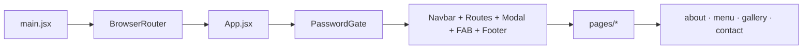

# ARANYAM — Jungle Theme Restaurant

> Premium jungle-themed **marketing SPA** for Aranyam (Amogham Foods) — freelance concept redesign across **Warangal · Karimnagar · Hyderabad**.

| | |
|---|---|
| **Stack** | React 18 · Vite 5 · React Router 7 · Tailwind CSS 3 · Lucide |
| **Runtime** | Browser-only static SPA (`dist/` after build) |
| **Source** | JavaScript (`.jsx`) — React in `src/`, no app TypeScript |
| **Author** | Pranith Konda |

---

## Frameworks & tooling

| Package | Version | What it does in this repo |
|---------|---------|---------------------------|
| **react** / **react-dom** | ^18.3.1 | UI via function components + hooks (`useState`, `useEffect`, `useRef`, `useCallback`) |
| **vite** | ^5.4.2 | Dev server, HMR, production bundle; entry `index.html` → `src/main.jsx` |
| **@vitejs/plugin-react** | ^4.3.1 | Fast Refresh for JSX |
| **react-router-dom** | ^7.15.1 | Client routing: `BrowserRouter`, `Routes`, `Route`, `Link`, `useLocation` |
| **tailwindcss** | ^3.4.19 | Utility CSS; theme in `tailwind.config.js` (not Tailwind v4 runtime) |
| **postcss** + **autoprefixer** | ^8.5 / ^10.5 | Compiles Tailwind via `postcss.config.js` |
| **lucide-react** | ^0.344.0 | Tree-shakeable SVG icons |
| **eslint** (+ react-hooks, react-refresh) | ^9.9 | Flat config in `eslint.config.js` |

**In `package.json` but unused in `src/`:** `@supabase/supabase-js` (reserved for future reservations/API).  
**Not used:** Next.js, Framer Motion, Redux/Zustand, CSS-in-JS libraries.

### Why these choices

| Decision | Rationale |
|----------|-----------|
| **Vite over CRA/Next** | Fast local dev, simple static deploy; no SSR/CMS needed for a pitch site |
| **Tailwind v3** | Custom `jungle` / `gold` / `earth` tokens and keyframes live in `tailwind.config.js` (project was stabilized on v3 during build) |
| **React Router** | Shared shell (nav, footer, booking modal) on every URL; `/` still stacks all sections for one-page demos |
| **Local state only** | Small surface area; no global store until real APIs exist |

---

## Project insights

### Architecture pattern

**Thin pages, fat components.** `src/pages/*` only import section components and set layout (`pt-24`, background). Business UI lives in `src/components/`.

**Persistent shell** (`App.jsx`): `PasswordGate` → `Navbar` → `<Routes>` → `BookingModal` → `FloatingActionButtons` → `Footer`. Hero (`HeroSection`) is defined in `App.jsx` and injected into `Home` as a prop—not its own route.



### Navigation model

| Mode | Behavior |
|------|----------|
| **Route-based** | `/about`, `/menu`, `/gallery`, `/contact` — full page per section |
| **Landing** | `/` — hero + all sections in one scroll (pitch / portfolio view) |
| **Navbar** | `Link` + `useLocation()` for active styling; scroll-shrink logo; mobile drawer with body scroll lock |

### Data & state

| Layer | Implementation |
|-------|----------------|
| **Content** | Static arrays in components (`DISHES`, `CATEGORIES`, `photos`, `videos`, location objects) |
| **Menu** | ~30 dishes, 7 categories, client-side veg + search filters |
| **Gallery** | 6 photos + 5 videos; lightbox; 9:16 video cards (`preload="metadata"`) |
| **Booking** | Modal state in `App.jsx`; `onBookTable` callback to Navbar / Hero / Menu |
| **Demo lock** | `PasswordGate` — client-side compare only (**not** production auth) |

No REST/GraphQL, env-based API, or form submission backend yet.

### UX & performance techniques

- Hero **parallax** via `requestAnimationFrame` + `scrollY` (in `HeroSection`)
- Menu images: `loading="lazy"`, `decoding="async"`
- Menu section: `background-attachment: fixed` parallax on desktop (scroll on mobile/iOS)
- **IntersectionObserver** hook `useScrollReveal` in `App.jsx` (ready for section animations)
- Custom scrollbar / smooth scroll in global CSS (`index.css`)
- Passive scroll listeners where attached (`navbar.jsx`)

### Design system (Tailwind)

| Token | Use |
|-------|-----|
| `jungle-950` (`#041504`) | Page background |
| `gold-400` / `gold-500` | Headlines, CTAs, borders |
| `earth-800+` | Mobile menu gradients |

**Fonts** (Google Fonts in `index.css`): Cinzel (UI/headings), Cormorant Garamond (body), Inter (fallback).  
**Motion** (`tailwind.config.js`): `shimmer`, `glow`, `leaf-sway`, fade/slide keyframes.

---

## Routes & components

| Path | Page | Renders |
|------|------|---------|
| `/` | `home.jsx` | `HeroSection` + about + menu + gallery + contact |
| `/about` | `aboutpage.jsx` | `about.jsx` |
| `/menu` | `menupage.jsx` | `menu.jsx` |
| `/gallery` | `gallerypage.jsx` | `gallery.jsx` |
| `/contact` | `contactpage.jsx` | `contact.jsx` |

| Component | Key responsibility |
|-----------|-------------------|
| `navbar.jsx` | Sticky nav, mobile menu, route highlight |
| `about.jsx` | Story, 3 cities, stats; stacked mobile / 2-col desktop |
| `menu.jsx` | Filterable menu grid, parallax bg |
| `gallery.jsx` | Photo grid + lightbox + video grid |
| `contact.jsx` | Locations, hours, reservation form UI |
| `bookingmodal.jsx` | Phones + Swiggy / Zomato / District links |
| `floatingActionbuttons.jsx` | Scroll-to-top + shortcuts |
| `footer.jsx` | Brand, social, links |

---

## Repository layout

```
ARANYAM/
├── public/                 # Served at / — images, videos, favicon
├── src/
│   ├── main.jsx            # createRoot + BrowserRouter
│   ├── App.jsx             # Gate, hero, routes, booking state
│   ├── index.css           # @tailwind + fonts + base styles
│   ├── pages/              # Route wrappers
│   └── components/         # Sections + chrome
├── tailwind.config.js
├── postcss.config.js
├── vite.config.js          # plugins: [react()]
└── package.json
```

---

## Quick start

```bash
npm install
npm run dev       # http://localhost:5173
npm run build     # output: dist/
npm run preview
npm run lint
```

**Node 18+** recommended.  
**Demo:** unlock via `PasswordGate` in `src/App.jsx` (password set in component).

---

## Static assets (`public/`)

| Assets | Purpose |
|--------|---------|
| `hero.jpg`, `logo.png`, `favicon.png` | Hero + branding |
| `logo2.png`, `logo3.jpg` | About / menu backgrounds |
| `gallery1.jpg`–`gallery6.jpg` | Gallery |
| `video1.mp4`–`video5.mp4` | Gallery videos |
| Dish images referenced in `menu.jsx` | Per-item photos |

Vite copies `public/` as-is; broken paths fail silently at runtime.

---

## Deploy

1. `npm run build` → upload **`dist/`** (Netlify, Vercel, GitHub Pages, etc.)
2. Enable **SPA fallback** (`/*` → `index.html`) so `/menu` works on refresh
3. No `.env` required until Supabase or APIs are wired

---

## Extending the project

| Next step | Suggested approach |
|-----------|-------------------|
| **Reservations** | Wire `contact.jsx` / modal forms to Supabase or a serverless function |
| **CMS / menu** | Replace `DISHES` array with fetched JSON or headless CMS |
| **Real auth** | Replace `PasswordGate` with server-side or hosting-level protection |
| **Type safety** | Migrate `src/` to `.tsx` (types already in devDependencies) |

---

## More docs

**`PROJECT_CONTEXT.md`** — build history, Tailwind v3 migration notes, design prompts.

---

## License

Private client concept work. All rights reserved unless agreed with the client.
